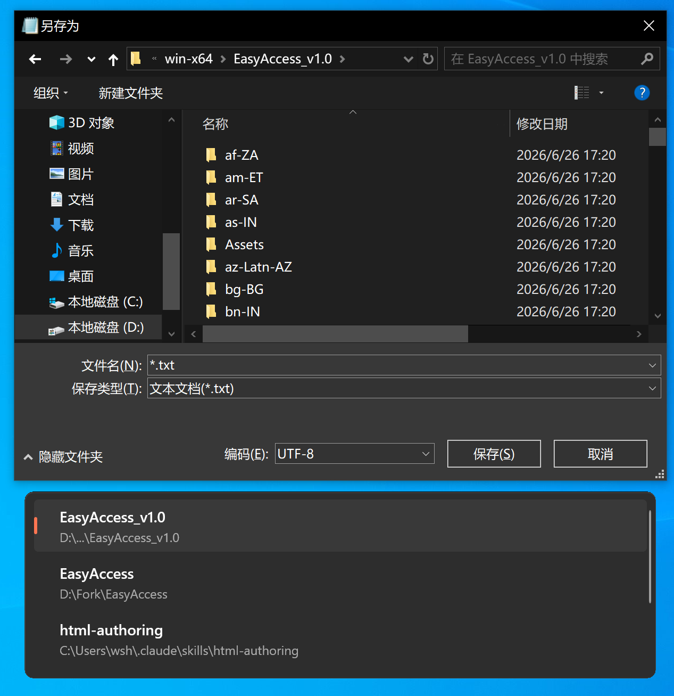

# EasyAccess

## 简介 / Introduction

EasyAccess 是一款轻量级 Windows 后台工具，自动检测文件打开/保存对话框，在对话框底部显示当前已打开的资源管理器文件夹列表，一键快速导航到目标文件夹。

EasyAccess is a lightweight Windows background utility that automatically detects file open/save dialogs and displays a list of currently open Explorer folders at the bottom of the dialog. Navigate to any folder with a single click.



## 为什么选择 EasyAccess？ / Why EasyAccess?

在处理多个不同文件夹的文件时，频繁在文件对话框中导航既繁琐又耗时。EasyAccess 解决了这个问题：

When working with multiple files across different folders, constantly navigating through file dialogs is tedious and time-consuming. EasyAccess eliminates this friction:

- **自动检测 / Auto-Detection** - 自动识别文件打开/保存对话框的出现 / Automatically detects when a file open/save dialog appears
- **快速导航 / Quick Navigation** - 在对话框覆盖层中直接显示已打开的资源管理器文件夹 / Shows open Explorer folders directly in the dialog overlay
- **一键访问 / One-Click Access** - 点击任意文件夹即可在对话框中导航到该位置 / Click any folder to instantly navigate to it in the dialog
- **零配置 / Zero Configuration** - 开箱即用，无需任何设置 / Works out of the box with no setup required
- **轻量级 / Lightweight** - 资源占用极少，静默后台运行 / Minimal resource usage, runs silently in the background
- **系统托盘 / System Tray** - 便捷的托盘图标，快速访问设置 / Convenient tray icon with quick settings access

## 功能特性 / Features

- 检测标准 Windows 文件打开/保存对话框 / Detects standard Windows file open/save dialogs
- 显示当前已打开资源管理器文件夹的覆盖层 / Displays overlay with currently open Explorer folders
- 支持暗色/亮色主题（跟随系统设置）/ Supports dark/light theme (follows system setting)
- 多显示器 DPI 感知 / Per-monitor DPI awareness
- UAC 提权检测 / UAC elevation detection
- 系统托盘配置（语言、主题、最大项目数、日志级别）/ System tray with configurable settings
- 单实例运行保护 / Single-instance enforcement
- 自动日志轮转（7 天）/ Automatic log rotation (7 days)

## 安装 / Installation

从 [Releases](../../releases) 页面下载最新版本。无需安装，直接运行可执行文件即可。

Download the latest release from the [Releases](../../releases) page. No installation required - just run the executable.

**系统要求 / Requirements:**
- Windows 10（1809 版本及以上）或 Windows 11 / Windows 10 (version 1809+) or Windows 11
- 无需额外运行时（自包含发布）/ No additional runtime needed (self-contained)

## 使用方法 / Usage

1. 运行 `EasyAccess.exe` / Run `EasyAccess.exe`
2. 应用在系统托盘中运行 / The app runs in the system tray
3. 打开任意文件对话框（打开、另存为等）/ Open any file dialog (Open, Save As, etc.)
4. 对话框下方出现覆盖层，显示已打开的资源管理器文件夹 / An overlay appears below the dialog showing your open Explorer folders
5. 点击文件夹即可导航到该位置 / Click a folder to navigate to it

右键点击托盘图标访问设置 / Right-click the tray icon to access settings:
- 显示/隐藏覆盖层 / Show/Hide overlay
- 切换语言（中文/English）/ Change language
- 调整最大显示文件夹数（1-5）/ Adjust max displayed folders
- 设置日志级别 / Set log level
- 查看版本信息 / View version info

---

## 开发 / Development

### 技术栈 / Tech Stack

| Component | Technology |
|-----------|------------|
| 语言 / Language | C# / .NET 8 |
| UI 框架 / UI Framework | WinUI 3 (Windows App SDK 2.2) |
| 项目类型 / Project Type | WinUI 3 Unpackaged |
| IDE | Visual Studio 2026 |
| 目标平台 / Target Platform | Windows 10 1809+ / Windows 11 |

### 构建 / Build

```bash
# Debug 构建（需要已安装 Windows App Runtime）
# Debug build (requires Windows App Runtime installed)
dotnet build EasyAccess/EasyAccess.csproj

# 运行 / Run
dotnet run --project EasyAccess/EasyAccess.csproj

# 发布自包含单文件 / Publish self-contained single file
dotnet publish -c Release -r win-x64 /p:PublishSingleFile=true
```

### 项目结构 / Project Structure

```
EasyAccess/
├── EasyAccess/                     # 主项目 / Main WinUI 3 project
│   ├── Core/                       # 核心逻辑 / Core logic (DialogDetector, FolderCollector, Navigator)
│   ├── Infra/                      # 基础设施 / Infrastructure (Config, Logger, SingleInstance)
│   ├── Interop/                    # 系统交互 / System interop (Win32 hooks, COM)
│   ├── UI/                         # UI 层 / UI layer (OverlayWindow, TrayIcon)
│   └── Util/                       # 工具类 / Utilities (NativeMethods, UacHelper)
├── config/                         # 配置文件 / Configuration files
├── docs/                           # 文档 / Documentation
└── utilitys/                       # C++ 辅助工具 / C++ helper tools
```

### 架构 / Architecture

四层单进程架构 / Four-layer single-process architecture:

1. **UI 层 / UI Layer** - OverlayWindow (WinUI 3), TrayIcon
2. **核心逻辑 / Core Logic** - DialogDetector, FolderCollector, Navigator
3. **系统层 / System Layer** - WinEventHook (P/Invoke), COM Shell, SendInput
4. **基础设施 / Infrastructure** - SingleInstance, ConfigManager, Logger

### 配置 / Configuration

配置文件 `config.json` 存储在 exe 同目录或 `%APPDATA%\EasyAccess\`。

Configuration file `config.json` is stored next to the executable or in `%APPDATA%\EasyAccess\`.

| Key | Type | Default | 说明 / Description |
|-----|------|---------|-------------------|
| ShowOverlayOnDetect | bool | true | 检测到对话框时是否显示覆盖层 / Show overlay when dialog detected |
| MaxOverlayItems | int | 3 | 最大显示文件夹数（1-5）/ Max folders to display |
| Theme | string | "system" | 主题：system/light/dark / Theme |
| LogLevel | string | "info" | 日志级别：debug/info/warn/error / Log level |
| Language | string | "zh" | 界面语言：zh/en / UI language |

### 依赖 / Dependencies

| Package | Version | 用途 / Purpose |
|---------|---------|---------------|
| Microsoft.WindowsAppSDK | 2.2.0 | WinUI 3 运行时 / WinUI 3 runtime |
| Microsoft.Windows.SDK.BuildTools | 10.0.28000.1839 | Win32/COM 构建工具 / Win32/COM build tools |

---

## 许可 / License

MIT License
